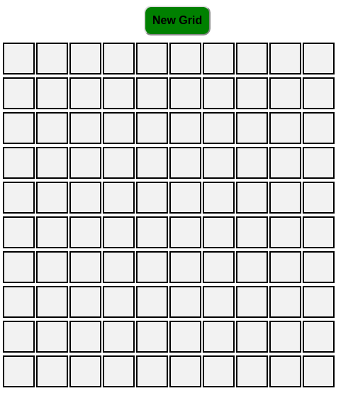

# Sketch Pad
                                  
This is my implementation on JavaScript/jQuery project assigned by The Odin Project(http://www.theodinproject.com).
I have used jQuery to dynamically add HTML elements and add effects to it such as if a user hovers over the 
Grid the color of the grid changes so that it can give a meaning to the sketch pad. I have also used some CSS to style it.
As a user, You have the option to create new grids by simply specifying width and height of the grids.

Feel free to play with it!

[Click here to see it live!](http://htmlpreview.github.io/?https://github.com/hasan3d/sketch-pad/master/index.html)

###Screenshot of the Sketch Pad:

